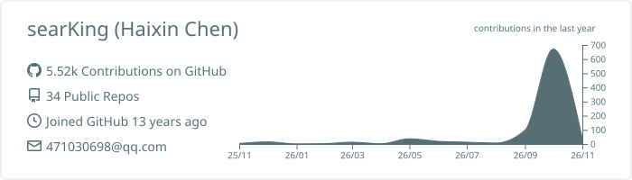
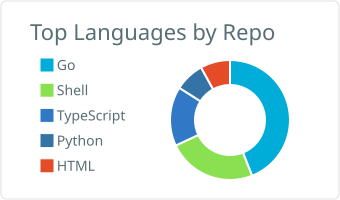
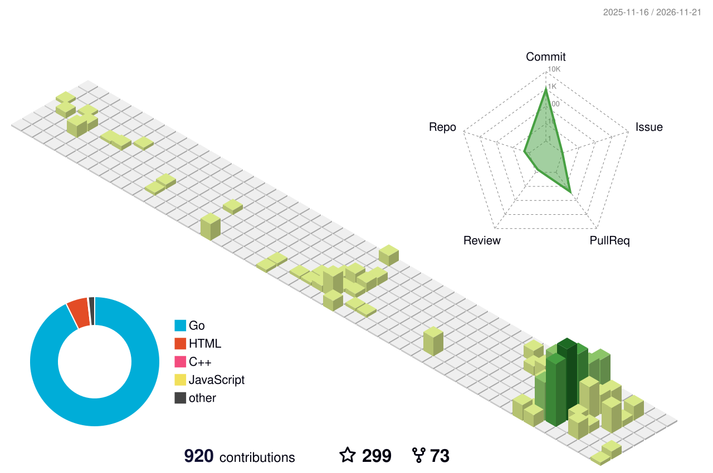

[](https://visitorbadge.io/status?path=https%3A%2F%2Fgithub.com%2FsearKing)

## Tech Stack

| Property         	| Data                                                                               	|
|------------------	|------------------------------------------------------------------------------------	|
| Language         	| Go/Cgo, C/C++, Python, TypeScript, VHDL                                                 |
| Domain Knowledge 	| AI, Linux, FFmpeg, OpenCV, Streaming Media, Kubernetes                                            	|
| Database         	| MySQL, Redis, Sqlite, MongoDB                                                       |
| OS               	| MacOS, CentOS, Windows                                                              |
| Editor           	| GoLand/CLion/PyCharm/Gateway, VsCode, VIM                                                                 |
| Terminal          | Iterm2, Oh My Zsh, Tmux                                                             |

<picture>
  <source media="(prefers-color-scheme: dark)" srcset="https://raw.githubusercontent.com/searKing/searKing/github-contribution-grid-snake-output/github-contribution-grid-snake-dark.svg" />
  <source media="(prefers-color-scheme: light)" srcset="https://raw.githubusercontent.com/searKing/searKing/github-contribution-grid-snake-output/github-contribution-grid-snake.svg" />
  
</picture>

<details>
<summary>GitHub Stats</summary>
<br>

<a href="https://github.com/searKing"><picture>
  <source media="(prefers-color-scheme: dark)" srcset="https://raw.githubusercontent.com/searKing/searKing/github-profile-summary-cards-output/github_dark/0-profile-details.svg" />
  
</picture></a>
<a href="https://github.com/searKing/golang"><picture>
  <source media="(prefers-color-scheme: dark)" srcset="https://raw.githubusercontent.com/searKing/searKing/github-profile-summary-cards-output/github_dark/1-repos-per-language.svg" />
  
</picture></a>
<a href="https://github.com/searKing/golang"><picture>
  <source media="(prefers-color-scheme: dark)" srcset="https://raw.githubusercontent.com/searKing/searKing/github-profile-summary-cards-output/github_dark/2-most-commit-language.svg" />
  
</picture></a>
<a href="https://github.com/searKing/golang"><picture>
  <source media="(prefers-color-scheme: dark)" srcset="https://raw.githubusercontent.com/searKing/searKing/github-profile-summary-cards-output/github_dark/3-stats.svg" />
  
</picture></a>
<a href="https://github.com/searKing/golang"><picture>
  <source media="(prefers-color-scheme: dark)" srcset="https://raw.githubusercontent.com/searKing/searKing/github-profile-summary-cards-output/github_dark/4-productive-time.svg" />
  
</picture></a>
</details>

<details>
<summary>3D Contributions</summary>
<br>

<picture>
  <source media="(prefers-color-scheme: dark)" srcset="https://raw.githubusercontent.com/searKing/searKing/github-profile-3d-contrib-output/profile-night-green.svg" />
  
</picture>
</details>

<details>
<summary>Wakatime Stats</summary>
<br>
<!--START_SECTION:waka-->

```txt
From: 10 November 2026 - To: 17 November 2026

Total Time: 38 hrs 33 mins

Go                17 hrs 16 mins        ███████████▒░░░░░░░░░░░░░   44.80 %
Markdown          5 hrs 52 mins         ███▓░░░░░░░░░░░░░░░░░░░░░   15.23 %
Python            4 hrs 14 mins         ██▓░░░░░░░░░░░░░░░░░░░░░░   11.01 %
Bash              2 hrs 18 mins         █▒░░░░░░░░░░░░░░░░░░░░░░░   05.97 %
Text              1 hr 51 mins          █▒░░░░░░░░░░░░░░░░░░░░░░░   04.81 %
Protocol Buffer   1 hr 25 mins          █░░░░░░░░░░░░░░░░░░░░░░░░   03.68 %
C++               1 hr 23 mins          █░░░░░░░░░░░░░░░░░░░░░░░░   03.63 %
Docker            1 hr 10 mins          ▓░░░░░░░░░░░░░░░░░░░░░░░░   03.04 %
YAML              1 hr 9 mins           ▓░░░░░░░░░░░░░░░░░░░░░░░░   02.99 %
protobuf          28 mins               ▒░░░░░░░░░░░░░░░░░░░░░░░░   01.21 %
```

<!--END_SECTION:waka-->

</details>

[](https://leetcode.cn/chen-hai-xin-3/)
